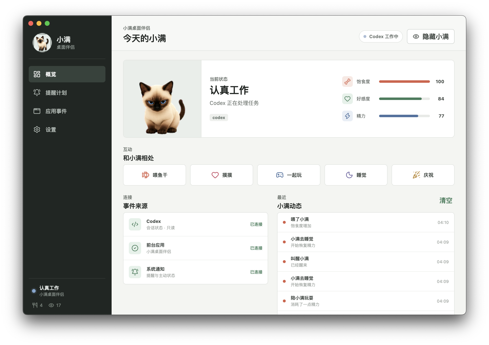

# 小满桌面伴侣

小满桌面伴侣是一个独立的 macOS 应用，为小满增加透明桌面悬浮窗、平滑注视、互动养成、提醒、声音、Codex 状态和外部应用事件。

它不会修改或替换 Codex 原生宠物包。应用未启动时，`~/.codex/pets/xiaoman/pet.json` 与 `spritesheet.webp` 仍按原方式工作。



## 功能

- 透明、可拖动、始终置顶的桌面小满
- 宿主专用 32 方向注视图，每 11.25 度一帧
- 可选 30Hz / 60Hz 鼠标采样与渲染
- 注视死区、角度迟滞和时间阻尼，减少鼠标靠近时抖动
- 喂养、摸摸、玩耍、睡觉、叫醒和庆祝互动
- 饱食度、好感度、精力、用餐次数与互动次数
- 本地合成的喵声、呼噜声、铃声、咔嚓声和提示音
- 一次、每天、工作日和每周提醒计划
- macOS 系统通知与饥饿、困倦、长任务主动通知
- 只读监听 `~/.codex/sessions/**/*.jsonl` 的任务状态
- 根据前台应用名称触发小满状态、声音和可选通知
- 菜单栏入口、登录时启动和本地持久化

## 安装

打开发布目录中的 DMG，将“小满桌面伴侣”拖到“应用程序”。本地构建未使用 Apple Developer 证书签名；第一次打开时可在 Finder 中右键应用并选择“打开”。

应用不要求配置 Codex。首次启动后会自动建立自己的数据文件，并在控制中心显示监听状态。

## 使用

- 单击小满：摸摸
- 双击小满：打开控制中心
- 拖动小满：移动悬浮窗
- 右键小满：打开互动菜单
- 悬停小满：显示喂养、控制中心和饱食度控件
- 菜单栏图标：显示/隐藏、互动或退出

控制中心包含“概览”“提醒计划”“应用事件”“设置”四个视图。注视刷新率默认 60Hz，可在“设置 → 显示与注视”切换为 30Hz。

## 兼容边界

| 场景 | 结果 |
| --- | --- |
| 宿主没有安装或没有启动 | Codex 原生小满照常工作 |
| 宿主正在运行 | 桌面出现独立小满，并启用扩展功能 |
| Codex 没有运行 | 互动、养成、提醒和应用事件仍可用 |
| Codex 会话目录不可用 | 宿主显示监听不可用，其他功能不受影响 |
| 宿主退出 | 不写入或删除 Codex 原生宠物文件 |

## 本地数据

macOS 数据文件位于：

```text
~/Library/Application Support/小满桌面伴侣/xiaoman-data.json
```

该文件保存数值、提醒、应用规则、设置、悬浮窗位置和最近动态。运行时不调用云端接口。详细边界见 [docs/PRIVACY.md](docs/PRIVACY.md)。

## 开发

要求 Node.js 20 或更高版本。

```bash
npm install
npm run dev
```

验证与构建：

```bash
npm run typecheck
npm test
npm run build
npm run pack:mac
npm run dist:mac
```

生成的应用和安装包位于 `release/`。架构与状态说明见：

- [docs/ARCHITECTURE.md](docs/ARCHITECTURE.md)
- [docs/STATES.md](docs/STATES.md)
- [docs/DEVELOPMENT.md](docs/DEVELOPMENT.md)
- [docs/DELIVERY.md](docs/DELIVERY.md)
- [SECURITY.md](SECURITY.md)

干净发布仓库还包含 `codex-pet/`：其中既有可直接安装的原生 Codex 两文件宠物，也有可由 Codex 复用的 `hatch-pet` 技能、确定性脚本、测试、QA 证据和小满完整制作案例。`work/` 保留宿主专用 32 方向图的最终提示词、选中结果、组图脚本与生产版验证材料。

## 许可证

应用代码使用 MIT License。小满图像资产的授权边界见 [ASSETS_LICENSE.md](ASSETS_LICENSE.md)，第三方依赖见 [THIRD_PARTY_NOTICES.md](THIRD_PARTY_NOTICES.md)。
