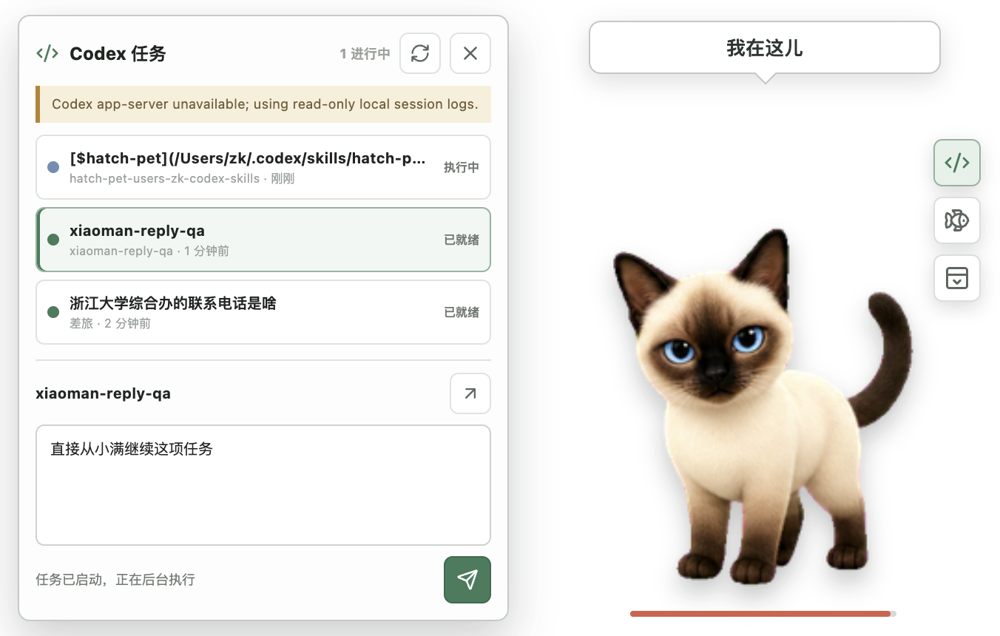

# 小满桌面伴侣

小满桌面伴侣是一个独立的 macOS 应用，为小满增加透明桌面悬浮窗、平滑注视、互动养成、提醒、声音、Codex 任务控制和外部应用事件。

它不会修改或替换 Codex 原生宠物包。应用未启动时，`~/.codex/pets/xiaoman/pet.json` 与 `spritesheet.webp` 仍按原方式工作。



## 功能

- 透明、可拖动、始终置顶的桌面小满
- 可关闭注视，或选择上半区 180° / 全向 360° 跟随
- 可选 30Hz / 60Hz，支持跟随速度、中心死区和静止回正时间
- 使用原生宠物的 16 个标准方向帧，低头阶段限速收敛且不叠图
- 拖动时按方向奔跑，悬停时跳跃
- 可分别启用舔嘴、眨眼、挠头和随机待机说话
- 可添加、删除、恢复待机词条，最多 40 条、每条最多 80 字符
- 小满体型可在 150–340px 调整，窗口按右下锚点同步缩放
- 喂养、摸摸、玩耍、睡觉、叫醒和庆祝互动
- 饱食度、好感度、精力、用餐次数与互动次数
- 本地合成的互动声音、提醒计划、系统通知和主动状态通知
- 根据前台应用名称触发小满状态、声音和可选通知
- 显示本机 Codex 最近任务、当前状态、工作区和更新时间
- 在悬浮窗或控制中心直接回复任务，也可打开对应 Codex 任务
- 菜单栏入口、登录时启动和本地持久化

## 安装

打开发布目录中的 DMG，将“小满桌面伴侣”拖到“应用程序”。本地构建未使用 Apple Developer 证书签名；第一次打开时可在 Finder 中右键应用并选择“打开”。

应用不要求额外配置 Codex。首次启动后会自动建立自己的数据文件，并在控制中心显示可用能力。

## 使用

- 单击小满：摸摸
- 双击小满：打开控制中心
- 拖动小满：移动悬浮窗，并播放左右奔跑动作
- 右键小满：打开互动菜单
- 悬停小满：显示快捷回复、喂养和控制中心按钮，并播放跳跃动作
- 点击 `</>`：在悬浮窗中选择任务并直接回复
- 菜单栏图标：显示/隐藏、互动或退出

控制中心包含“概览”“功能管理”“Codex 任务”“提醒计划”“应用事件”“设置”六个视图。所有扩展能力均可在“功能管理”中独立开关；注视模式、刷新率、回正时间和体型在“设置”中调整。

### Codex 回复语义

- 正在执行或等待输入的任务：回复写入 Codex 本机队列；当前一轮结束后自动继续，界面明确显示“已排队”。
- 已结束或空闲任务：通过本机 Codex CLI 在后台续跑，不需要先打开 Codex 主窗口。
- “在 Codex 中打开”：使用 `codex://threads/<thread-id>` 打开对应任务。
- 只有 Codex CLI 明确输出 `turn.started` 后才显示启动成功；立即退出、超时或无确认都会显示错误。

## 兼容边界

| 场景 | 结果 |
| --- | --- |
| 宿主没有安装或没有启动 | Codex 原生小满照常工作 |
| 宿主正在运行 | 桌面出现独立小满，并启用扩展功能 |
| Codex 没有运行 | 互动、养成、提醒和应用事件仍可用 |
| Codex CLI / 会话目录不可用 | 任务列表或回复显示不可用，其他功能不受影响 |
| 宿主退出或卸载 | 不写入或删除 Codex 原生宠物文件 |

## 本地数据与隐私

macOS 数据文件位于：

```text
~/Library/Application Support/小满桌面伴侣/xiaoman-data.json
```

该文件保存数值、提醒、应用规则、待机词条、设置、悬浮窗位置和最近动态。应用不包含遥测、分析、更新器或自建云服务。只有用户主动发送 Codex 回复时，应用才调用已安装的 Codex CLI；该命令沿用用户现有的 Codex 登录、网络和数据策略。详细边界见 [docs/PRIVACY.md](docs/PRIVACY.md)。

## 开发

要求 Node.js 20 或更高版本。

```bash
npm install
npm run dev
```

验证与构建：

```bash
npm run typecheck
npm test
npm run build
npm run pack:mac
npm run dist:mac
```

生成的应用和安装包位于 `release/`。详细资料见：

- [docs/ARCHITECTURE.md](docs/ARCHITECTURE.md)
- [docs/STATES.md](docs/STATES.md)
- [docs/DEVELOPMENT.md](docs/DEVELOPMENT.md)
- [docs/DELIVERY.md](docs/DELIVERY.md)
- [docs/PRIVACY.md](docs/PRIVACY.md)
- [SECURITY.md](SECURITY.md)

干净发布仓库还包含 `codex-pet/`：其中既有可直接安装的原生 Codex 两文件宠物，也有可由 Codex 复用的 `hatch-pet` 技能、确定性脚本、测试、QA 证据和小满完整制作案例。`work/` 保留生成提示词、选中结果、图集验证和真实窗口 QA 材料。

## 许可证

应用代码使用 MIT License。小满图像资产的授权边界见 [ASSETS_LICENSE.md](ASSETS_LICENSE.md)，第三方依赖见 [THIRD_PARTY_NOTICES.md](THIRD_PARTY_NOTICES.md)。
