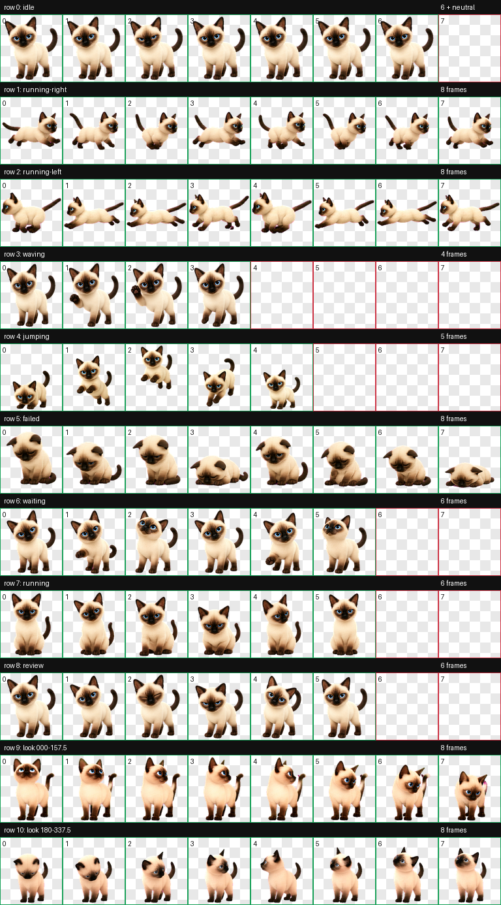

# Xiaoman (小满) Codex Pet

Xiaoman is a Codex-compatible animated pet based on the owner's real Siamese cat. The runtime package uses the Codex v2 pet contract: one manifest plus one 8x11 spritesheet containing nine action rows and sixteen pointer-look directions.



## Quick install

No API key, background service, model download, or extra configuration is required. Install the prepared archive into the local Codex pet directory:

```bash
mkdir -p "${CODEX_HOME:-$HOME/.codex}/pets/xiaoman"
cp pet/xiaoman/pet.json pet/xiaoman/spritesheet.webp \
  "${CODEX_HOME:-$HOME/.codex}/pets/xiaoman/"
```

The result must be:

```text
${CODEX_HOME:-$HOME/.codex}/pets/xiaoman/
├── pet.json
└── spritesheet.webp
```

Open the Codex pet selector and choose `小满`. If the running desktop app does not refresh the pet list, restart it once.

The public source tree intentionally does not include generated ZIP archives. The two runtime files above are the complete install payload.

## Why the installed pet has only two files

This is intentional, not a missing dependency:

- `pet.json` identifies the pet, gives it a display name and description, declares `spriteVersionNumber: 2`, and points to the image file.
- `spritesheet.webp` contains every visible frame in a single `1536x2288` image. Codex knows the cell size, row meanings, frame counts, timing, and sixteen look directions from the v2 contract.

Prompts, scripts, tests, previews, and QA reports are authoring and verification material. Codex does not load them when displaying a pet, so they stay in this repository instead of being copied into `~/.codex/pets/xiaoman`.

See [Package Format](docs/PACKAGE-FORMAT.md) for the complete layout.

## Repository contents

```text
pet/xiaoman/              Installable two-file runtime package
previews/                 Contact sheet, direction sheet, and action GIFs
qa/                       Sanitized machine and human review evidence
workflow/                 Xiaoman-specific prompts, request, and process notes
scripts/                  Reusable deterministic hatch-pet tooling
tests/                    Unit tests for the reusable tooling
references/               Codex v2 row, package, and QA contracts
SKILL.md                   Reusable Codex hatch-pet skill instructions
```

Original cat photographs, raw model outputs, discarded candidates, API credentials, and private relay configuration are deliberately excluded. See [Privacy](docs/PRIVACY.md).

## Validate locally

Python 3.12 and Pillow are sufficient for the included deterministic tooling:

```bash
python3 -m venv .venv
source .venv/bin/activate
python -m pip install -r requirements.txt
python scripts/validate_atlas.py \
  pet/xiaoman/spritesheet.webp \
  --chroma-key '#FF00FF' \
  --require-v2
python -m unittest discover -s tests -p 'test_*.py'
```

The accepted release has:

- v2 dimensions `1536x2288`, arranged as `8x11` cells of `192x208`
- all required action and look cells populated
- zero atlas validation errors and warnings
- zero hidden RGB residue under fully transparent pixels
- alpha-preserving chroma despill with no rejected pixels
- labeled, blind-pair, continuity, and final visual review records

Some automated look-direction checks intentionally emit `reviewRequired` for subtle intermediate poses. The final decision and evidence are recorded in `qa/blind-review-resolution.json`; all cardinal directions and the ordered clockwise loop were accepted.

## Reusing the workflow in Codex

The repository root is also a reusable `hatch-pet` skill source. `SKILL.md`, `scripts/`, `tests/`, and `references/` form the generic workflow. `workflow/` is the Xiaoman-specific worked example.

Image generation is not bit-for-bit reproducible: model output can vary, and this repository does not include a private image-generation relay. Preparation, frame extraction, atlas assembly, chroma cleanup, package validation, contact sheets, motion previews, and direction QA are deterministic and reusable.

Read [Process](workflow/PROCESS.md) before adapting the prompts, and read [Retrospective](workflow/RETROSPECTIVE.md) to avoid the retries encountered in this run.

## Runtime behavior and extensions

- [Action Triggers](docs/ACTION-TRIGGERS.md) documents when each row is selected in the current Codex desktop build.
- [Extending Xiaoman](docs/EXTENDING.md) separates artwork changes supported by the two-file package from behavior that requires a desktop host or plugin SDK.
- [Related Projects](docs/RELATED-PROJECTS.md) lists open-source hosts with broader interaction models.

The custom-pet renderer is an observed local runtime contract, not a documented public OpenAI extension API. Behavior was verified against ChatGPT desktop `26.818.61809` (build `7019`) on 2026-08-26 and may change in later releases.

## Licensing

Reusable code and documentation are provided under the Apache License 2.0 in [LICENSE](LICENSE). Xiaoman's generated artwork and previews have separate terms in [ASSETS_LICENSE.md](ASSETS_LICENSE.md). Third-party notices are in [THIRD_PARTY_NOTICES.md](THIRD_PARTY_NOTICES.md).
